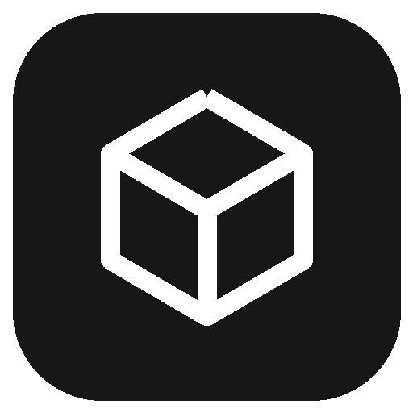
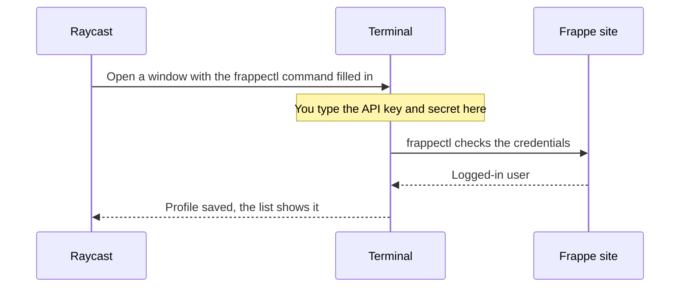

<div align="center" markdown="1">

<p>
	
	
</p>
<h1>Raycast extensions for Frappe developers</h1>

**Manage Frappe sites and dev boxes from Raycast**

</div>

Two Raycast extensions that put everyday Frappe chores one keystroke away: picking a site profile, logging in to a new site, rotating API keys, and getting into a dev box. Both are thin front ends over command-line tools, so nothing here stores credentials of its own.

### Extensions

- **[Frappectl](frappectl)**: manage the site profiles of [frappectl](https://github.com/frappe/frappectl), the command-line client for Frappe sites
- **[Devbox](devbox)**: list, attach to and provision dev boxes through a `devboxctl` script

### Features

Frappectl:

- **List Profiles**: search every stored profile, see its site, auth type and read-only flag, and open the site or copy its URL
- **Add Site**: fill in a form, then finish the login in your terminal (OAuth in the browser, or API key and secret)
- **Refresh API Keys**: re-enter the key and secret for a profile, keeping its name, description and read-only flag
- Make a profile writable or read-only, and delete a profile with its stored credentials

Devbox:

- **Dev Boxes**: see your boxes with status, template and memory use, and attach to one in a terminal
- Open a box's site, web editor or web terminal, copy its slug or attach command, and give it a nickname
- Start, stop and delete a box, each behind a confirmation
- **Provision Dev Box**: pick a profile and branch, then watch the provisioning run in your terminal

### How it works



Logging in always happens in a real terminal. frappectl refuses to read credentials from a pipe, so they never end up in shell history or logs, and these extensions keep it that way. Everything else (listing, toggling read-only, deleting) runs in the background.

### Installation

You need macOS, [Raycast](https://www.raycast.com), Node.js 22 or later, and iTerm or Terminal.

1. Install frappectl: `uv tool install frappectl`
2. For Devbox, put your `devboxctl` script at `~/bin/devboxctl` and add a frappectl profile named `devbox` for the site that tracks your boxes.
3. Load an extension into Raycast:

```bash
git clone https://github.com/Rl0007/raycast_.git
cd raycast_/frappectl
npm install
npm run dev
```

Repeat the last three steps in `devbox`. Raycast keeps the extensions after you stop `npm run dev`. Pick iTerm or Terminal in each extension's preferences.

### Development

```bash
npm run lint
npm run build
```

Run these inside `frappectl` or `devbox`.

### Support

Found a bug or have a question? [Open an issue](https://github.com/Rl0007/raycast_/issues).

#### License

MIT
